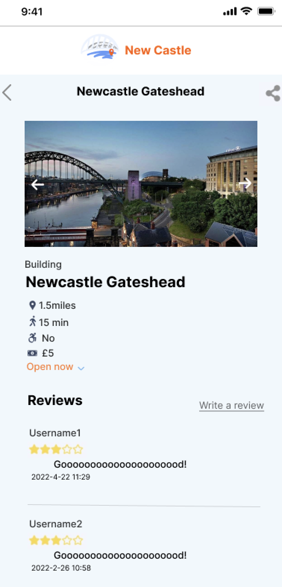
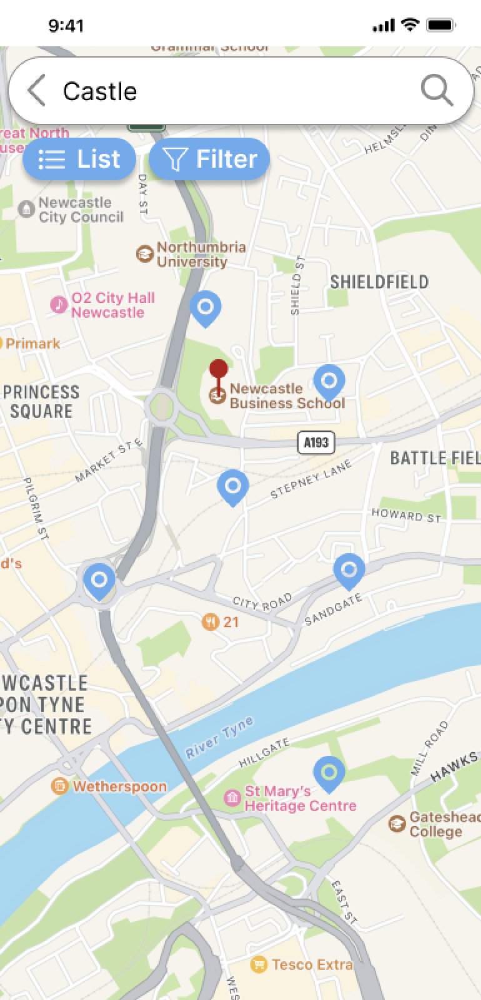
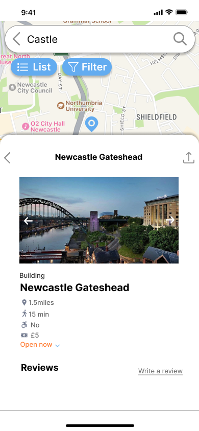
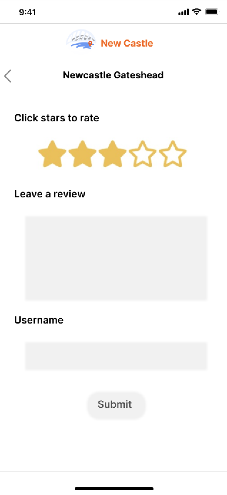

# Newcastle Tourism Backend

This repository contains the backend code for the Newcastle Tourism project. It is developed using a robust technology stack including Java with Spring Boot framework, and MySQL for database management.

## Technology Stack

- Java: The primary programming language used for backend development.
- Spring Boot: An open-source Java-based framework. 
- MySQL: A relational database management system used to store and manage the application's data persistently.

## UI and App Interface Showcases
 
This is the home page:

<img src="images/homepage.png" width="200")

This is the search page:


This is the function page:



This is the map display page:



This is the search by map page:



This is the user comment page:



## Structure

src/main/java/com/team21/attractionsGuide/controller - deal with requests and respond JSON bodies.

src/main/java/com/team21/attractionsGuide/entity - models related to database and http response struct

src/main/java/com/team21/attractionsGuide/error - customized error

src/main/java/com/team21/attractionsGuide/repository - interfaces. repository layer

src/main/java/com/team21/attractionsGuide/service - connection between repository and controller. They also process external APIs.

src/main/resources - configurations

src/test - Unit test

docs/index.html - Class documentation index

## Start project

### Change configuration

Local development configuration: src/main/resources/config/application-dev.yml

Production configuration: src/main/resources/config/application-pro.yml

To start in your own environment, change the database configuration.

deployment: https://16.16.179.85.nip.io/   Please note that this link is currently inactive as the deployment on Amazon Web Services (AWS) has expired. For a live demo or testing purposes, the application needs to be redeployed on a suitable hosting service or run locally.

### Run

```shell
mvn -N io.takari:maven:wrapper
mvn spring-boot:run
```


